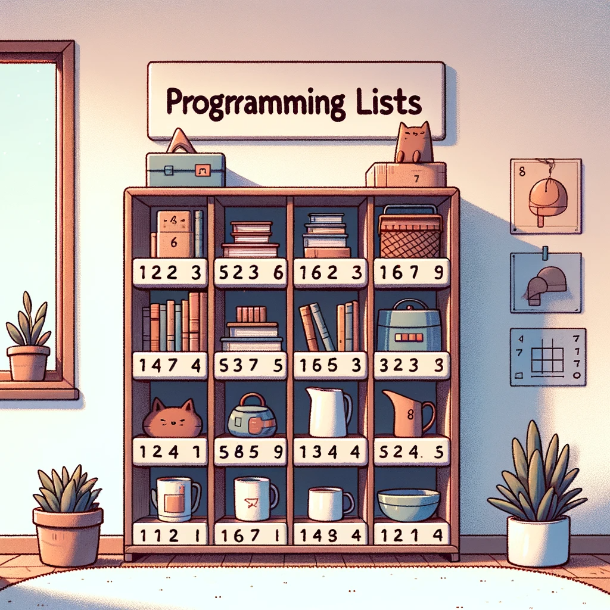
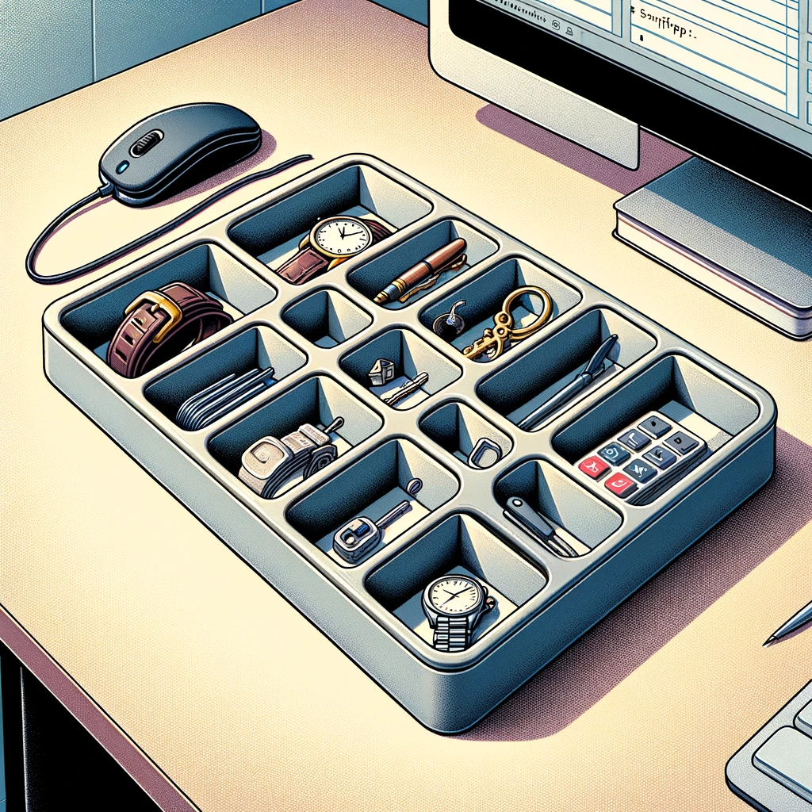

## Listas

Las listas en programación pueden ser comparadas con un estante con varios compartimentos. Imagina un estante en tu habitación, donde cada compartimento almacena diferentes objetos: un libro, una taza, una planta, etc. Cada objeto tiene su propio espacio y puedes acceder a él fácilmente sabiendo en qué compartimento se encuentra.

    

De manera similar, una lista en programación es una colección de elementos ordenados. Cada elemento en la lista es como un objeto en un compartimento del estante. Puedes agregar, quitar o buscar elementos específicos en la lista, así como puedes hacerlo con los objetos en los compartimentos del estante. Además, cada elemento en la lista tiene una posición específica, al igual que los objetos en el estante están organizados de manera ordenada.

### Algunos métodos:
- append(): Añade un ítem al final de la lista.
- clear(): Vacía todos los ítems de una lista.
- extend(): Une una lista a otra.
- count(): Cuenta el número de veces que aparece un ítem.
- index(): Devuelve el índice en el que aparece un ítem (error si no aparece).
- insert(): Agrega un ítem a la lista en un índice específico.
- pop(): Extrae un ítem de la lista y lo borra.
- remove(): Borra el primer ítem de la lista cuyo valor concuerde con el que indicamos.
- reverse(): Le da la vuelta a la lista actual.
- sort(): Ordena automáticamente los ítems de una lista por su valor de menor a mayor. (Esto no ordena cuando hay diferentes tipod de datos)

## Tuplas

Las tuplas en programación pueden ser comparadas con una bandeja con compartimentos fijos. Imagina una bandeja de oficina dividida en secciones, donde cada sección contiene un objeto diferente, como un reloj, un bolígrafo o una llave. Una vez que colocas un objeto en un compartimento, no puedes cambiarlo por otro; está fijo en su lugar.

    

De manera similar, una tupla en programación es una colección de elementos que se ordena de una manera específica y no se puede cambiar una vez creada. Esto significa que, a diferencia de las listas, no puedes agregar, eliminar o modificar los elementos de una tupla. Las tuplas son útiles cuando necesitas asegurarte de que los datos no se modificarán a lo largo de tu programa, proporcionando así una forma de mantener la integridad de los datos.

