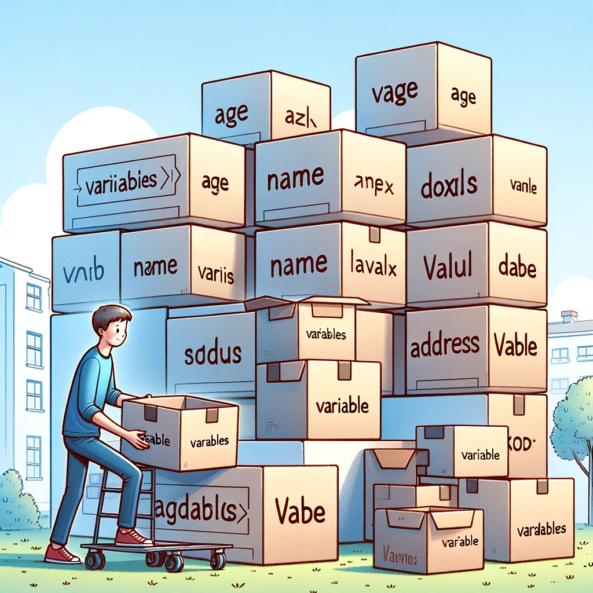

## Variables

Para entender el concepto de variables en programación, podemos hacer una analogía con cajas durante una mudanza. Imaginemos que nos estamos mudando y usamos cajas para almacenar diferentes objetos. Cada caja tiene una etiqueta que nos ayuda a identificar su contenido. De la misma manera, en programación, una variable es como una caja donde almacenamos datos. La 'etiqueta' de la caja es el nombre de la variable, y el 'contenido' de la caja es el valor que la variable almacena.

Por ejemplo, una variable llamada 'edad' puede contener el número 30, mientras que otra variable llamada 'nombre' puede contener el texto 'Ana'. Al igual que en la mudanza, donde las cajas nos ayudan a organizar y encontrar nuestras cosas fácilmente, en programación, las variables nos permiten almacenar y acceder a los datos de manera eficiente. Esta es una herramienta fundamental en el desarrollo de software, ya que nos permite manejar la información de manera clara y ordenada.

    

Al avanzar en el curso, exploraremos cómo se utilizan estas 'cajas' en Python y Django, aprendiendo sobre diferentes tipos de datos y cómo las variables nos permiten manipular esa información para crear aplicaciones web dinámicas y funcionales. 

## Tipos
